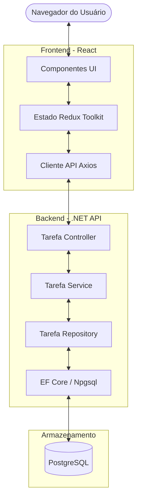
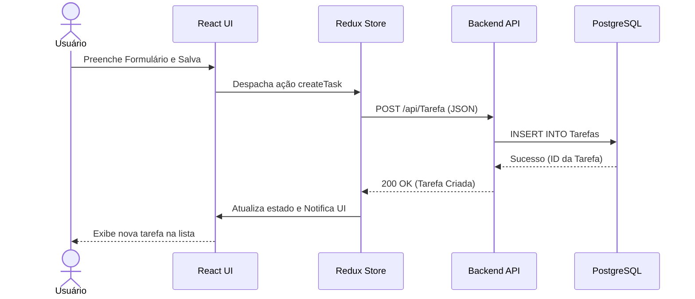

# TaskFlow - Sistema de Gerenciamento de Tarefas

TaskFlow é uma plataforma profissional de gerenciamento de tarefas projetada para ajudar usuários a organizar, priorizar e acompanhar suas atividades diárias. O sistema segue uma arquitetura modular com uma separação clara entre um backend robusto em .NET e um frontend moderno em React.

## 1. Visão Geral do Projeto

O sistema oferece um conjunto abrangente de recursos para o ciclo de vida das tarefas, incluindo:
- **Operações CRUD Completas:** Criar, ler, atualizar e excluir tarefas.
- **Gerenciamento de Prioridade e Status:** Categorizar tarefas por prioridade (Baixa, Média, Alta) e monitorar seu estado atual (Pendente, Concluída, etc.).
- **Filtragem Avançada:** Pesquisar e filtrar tarefas por título, data ou status.
- **UI/UX Moderna:** Interface responsiva construída com React e Styled-components.
- **Backend Escalável:** API RESTful construída com ASP.NET Core e Entity Framework Core.

## 2. Arquitetura do Sistema

O sistema TaskFlow é estruturado como uma arquitetura cliente-servidor. A aplicação frontend (React) comunica-se com uma API backend centralizada (ASP.NET Core), que por sua vez gerencia a persistência de dados em um banco de dados PostgreSQL.

### Componentes Principais
- **Frontend (todoreact):** Uma Single Page Application (SPA) que fornece a interface do usuário.
- **Backend API (tarefas-api):** Um serviço RESTful responsável pela lógica de negócio e acesso a dados.
- **Banco de Dados:** PostgreSQL para armazenamento de dados relacionais.

## 3. Diagrama de Arquitetura



## 4. Estrutura do Repositório

O repositório é organizado utilizando submódulos Git para manter ciclos de desenvolvimento independentes para cada componente.

```text
taskflow/
├── LICENSE
├── tarefas-api/            # Serviço Backend .NET (Submódulo)
│   ├── Src/                # Código Fonte (Controllers, Models, Services)
│   ├── Migrations/         # Migrações do Banco de Dados EF Core
│   ├── Dockerfile          # Configuração de Container
│   └── Program.cs          # Ponto de entrada da API
└── todoreact/              # Aplicação Frontend React (Submódulo)
    ├── src/
    │   ├── components/     # Componentes de UI reutilizáveis
    │   ├── store/          # Slices e configuração do Redux Toolkit
    │   ├── services/       # Camada de comunicação com a API (Axios)
    │   └── styles/         # Estilos globais e temas
    ├── package.json        # Dependências do Frontend
    └── vite.config.ts      # Configuração do Vite
```

## 5. Descrição dos Serviços

### Backend API (`tarefas-api`)
O motor central do sistema, construído com **ASP.NET Core**. Ele expõe uma interface RESTful para o gerenciamento de tarefas.
- **Responsabilidades:** Validação, aplicação de regras de negócio e orquestração do banco de dados.
- **Endpoints Principais:** `GET /api/Tarefa/ObterTodos`, `POST /api/Tarefa`, `PUT /api/Tarefa/{id}`, `DELETE /api/Tarefa/excluir/{id}`.
- **Acesso a Dados:** Utiliza Entity Framework Core com o provedor Npgsql para PostgreSQL.

### Aplicação Frontend (`todoreact`)
Uma aplicação web de alta performance construída com **React** e **TypeScript**.
- **Responsabilidades:** Renderização da lista de tarefas, manipulação de entradas do usuário e gerenciamento do estado global.
- **Gerenciamento de Estado:** Utiliza **Redux Toolkit** para sincronizar os dados das tarefas em toda a aplicação.
- **Estilização:** Implementa **Styled-components** para um sistema de design consistente e modular.

## 6. Tecnologias Utilizadas

### Backend
- **Framework:** .NET 10.0 (ASP.NET Core)
- **Linguagem:** C#
- **ORM:** Entity Framework Core
- **Banco de Dados:** PostgreSQL (Npgsql)
- **Documentação:** Swagger / OpenAPI

### Frontend
- **Framework:** React 19
- **Linguagem:** TypeScript
- **Gerenciamento de Estado:** Redux Toolkit
- **Estilização:** Styled-components
- **Ícones:** FontAwesome
- **Ferramenta de Build:** Vite

### Infraestrutura
- **Conteinerização:** Docker
- **Controle de Versão:** Git (com Submódulos)

## 7. Fluxo do Sistema

O seguinte diagrama de sequência ilustra o fluxo típico de criação de uma nova tarefa:



## 8. Executando o Sistema Localmente

### Pré-requisitos
- [.NET SDK 10.0+](https://dotnet.microsoft.com/download)
- [Node.js 20+](https://nodejs.org/)
- [PostgreSQL](https://www.postgresql.org/) (ou via Docker)

### Passo 1: Clonar o Repositório
```bash
git clone --recursive https://github.com/JovanneSousa/taskflow.git
cd taskflow
```
*Caso já tenha clonado sem os submódulos:*
```bash
git submodule update --init --recursive
```

### Passo 2: Configurar e Executar o Backend
1. Navegue até a pasta do backend:
   ```bash
   cd tarefas-api
   ```
2. Configure as variáveis de ambiente (ou atualize o `appsettings.json`):
   - `DB_CONNECTION`: Sua string de conexão com o PostgreSQL.
   - `MEU_APP`: Origem permitida para CORS (ex: `http://localhost:5173`).
3. Aplique as migrações:
   ```bash
   dotnet ef database update
   ```
4. Execute a API:
   ```bash
   dotnet run
   ```

### Passo 3: Configurar e Executar o Frontend
1. Abra um novo terminal e navegue até a pasta do frontend:
   ```bash
   cd todoreact
   ```
2. Instale as dependências:
   ```bash
   npm install
   ```
3. Crie um arquivo `.env` com a URL da API:
   ```env
   VITE_API_URL=http://localhost:5000
   ```
4. Inicie o servidor de desenvolvimento:
   ```bash
   npm run dev
   ```

## 9. Notas de Desenvolvimento

- **Modularidade:** Os serviços são independentes. Você pode atualizar o backend sem afetar o frontend, desde que o contrato da API seja mantido.
- **Operações Assíncronas:** Todas as chamadas de API e interações com o banco de dados são totalmente assíncronas para garantir alta disponibilidade.
- **Tipagem:** O projeto utiliza tipagem forte com TypeScript e C# para reduzir erros em tempo de execução e melhorar a produtividade.
- **Contribuições:** Ao contribuir, certifique-se de que os submódulos estejam atualizados e siga as convenções de nomenclatura estabelecidas em ambos os repositórios.
